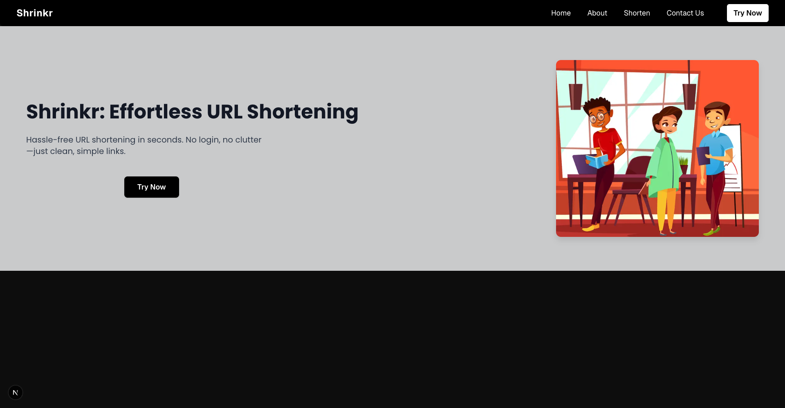

# 🔗 Shrinkr - Effortless URL Shortening

A modern, privacy-focused URL shortener designed for simplicity and speed. Shrinkr provides hassle-free, secure, and beautiful link sharing for everyone—no logins, no clutter, just pure utility.




## ✨ Features

- **🚀 Lightning Fast** - Generate short URLs in seconds
- **🔒 Privacy Focused** - No user accounts or tracking required
- **🎨 Modern UI** - Beautiful, responsive design with glassmorphism effects
- **📱 Mobile Friendly** - Works seamlessly on all devices
- **🔄 Custom URLs** - Create your own custom short URLs
- **📊 Duplicate Handling** - Smart handling of existing short URLs
- **🌙 Dark Theme** - Elegant dark interface for better UX

## 🛠️ Tech Stack

- **Frontend:** Next.js 14, React, Tailwind CSS
- **Backend:** Next.js API Routes
- **Database:** MongoDB
- **Styling:** Tailwind CSS with custom glassmorphism effects
- **Font:** Poppins (Google Fonts)
- **Deployment:** Vercel 

## 🚀 Getting Started

### Prerequisites

- Node.js 18+ 
- MongoDB database
- npm or yarn

### Installation

1. **Clone the repository**
   ```bash
   git clone https://github.com/yourusername/url-shortener.git
   cd url-shortener
   ```

2. **Install dependencies**
   ```bash
   npm install
   ```

3. **Environment Setup**
   Create a `.env.local` file in the root directory:
   ```env
   MONGODB_URI=your_mongodb_connection_string
   NEXT_PUBLIC_HOST=http://localhost:3000
   ```

4. **Run the development server**
   ```bash
   npm run dev
   ```

5. **Open your browser**
   Navigate to [http://localhost:3000](http://localhost:3000)

## 📖 Usage

### Creating Short URLs

1. Navigate to the **Shorten** page
2. Enter your long URL in the first input field
3. (Optional) Enter a custom short URL in the second field
4. Click **Shorten** to generate your short URL
5. Copy and share your new short URL!

### Features in Action

- **Custom URLs**: Create memorable short URLs like `yoursite.com/my-brand`
- **Duplicate Handling**: If a short URL already exists, you'll see the existing one
- **Instant Generation**: No waiting, no accounts, just instant results

## 🏗️ Project Structure

```
url-shortener/
├── app/
│   ├── api/
│   │   └── generate/
│   │       └── route.js          # API endpoint for URL shortening
│   ├── about/
│   │   └── page.js               # About page
│   ├── contact/
│   │   └── page.js               # Contact page
│   ├── shorten/
│   │   └── page.js               # URL shortening interface
│   ├── globals.css               # Global styles and Poppins font
│   ├── layout.js                 # Root layout
│   └── page.js                   # Homepage
├── components/
│   └── Navbar.js                 # Navigation component
├── lib/
│   └── mongodb.js                # MongoDB connection
└── public/
    └── vector.png                # Hero section illustration
```

## 🎨 Design Philosophy

Shrinkr embraces a **minimalist approach** with:

- **Glassmorphism Effects**: Semi-transparent cards with backdrop blur
- **Dark Theme**: Elegant black background with gray accents
- **Typography**: Clean Poppins font for excellent readability
- **Responsive Design**: Seamless experience across all devices
- **Smooth Animations**: Subtle transitions and hover effects

## 🔧 API Endpoints

### POST `/api/generate`

Creates a new short URL or returns existing one.

**Request Body:**
```json
{
  "url": "https://example.com/very-long-url",
  "shorturl": "custom-short"
}
```

**Response:**
```json
{
  "message": "Short URL generated successfully",
  "existingShortUrl": "http://localhost:3000/custom-short",
  "originalUrl": "https://example.com/very-long-url"
}
```

### Environment Variables for Production

```env
MONGODB_URI=your_production_mongodb_uri
NEXT_PUBLIC_HOST=https://your-domain.com
```

## 🤝 Contributing

We welcome contributions! Please feel free to submit a Pull Request.

1. Fork the repository
2. Create your feature branch (`git checkout -b feature/AmazingFeature`)
3. Commit your changes (`git commit -m 'Add some AmazingFeature'`)
4. Push to the branch (`git push origin feature/AmazingFeature`)
5. Open a Pull Request

## 📝 License

This project is licensed under the MIT License - see the [LICENSE](LICENSE) file for details.


